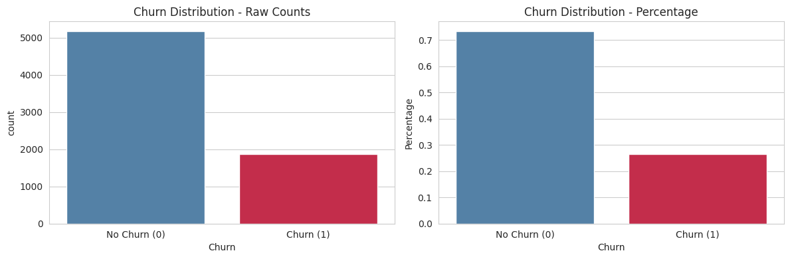

# 📱 Customer Churn Prediction


---

## 🔍 Problem Statement

Telecom companies lose significant revenue when customers cancel their subscriptions (churn).  
Acquiring a new customer costs **5–7x more** than retaining an existing one.

> **Goal:** Build a machine learning model that predicts whether a customer will churn —  
> enabling proactive retention strategies before it's too late.

---

## 🎯 Target Variable

| Value | Meaning |
|-------|---------|
| `0` | Customer stayed ✅ |
| `1` | Customer churned ❌ |

**Churn Rate in Dataset: 26.54%**

---

## 📊 Dataset Overview

| Feature | Description |
|---------|-------------|
| `tenure` | How long the customer has been with the company |
| `MonthlyCharges` | Monthly bill amount |
| `TotalCharges` | Total amount charged |
| `Contract` | Contract type (Month-to-month, One year, Two year) |
| `InternetService` | Type of internet service |
| `OnlineSecurity` | Whether customer has online security |
| `TechSupport` | Whether customer has tech support |
| + more | 20+ features total |

---

## ⚙️ Methodology

```
Data Loading → EDA → Preprocessing → SMOTE → Modeling → Evaluation
```

### Key Steps:
- **EDA** — Explored numerical and categorical features vs Churn
- **SMOTE** — Applied to handle class imbalance
  - Before: 3892 vs 1390
  - After: 3892 vs 3892 ✅
- **Preprocessing** — StandardScaler + OneHotEncoder via ColumnTransformer
- **Models** — Logistic Regression & Random Forest with GridSearchCV tuning

---

## 🤖 Models & Results

### Final Comparison — All Models

| Model | Recall (Churn) | Recall (No Churn) | Macro Recall | AUC |
|-------|---------------|-------------------|--------------|-----|
| Logistic Regression Default | 0.81 | 0.74 | 0.77 | — |
| **Logistic Regression Tuned** | **0.81** | **0.74** | **0.78** | **0.86** ✅ |
| Random Forest Default | 0.55 | 0.87 | 0.71 | — |
| Random Forest Tuned | 0.57 | 0.86 | 0.72 | 0.83 |

### 🏆 Recommended Model: Logistic Regression (Tuned)
- **Recall = 0.81** — Correctly identifies 81% of churners
- **AUC = 0.86** — Best overall discrimination
- GridSearch Best Params: `C=10, penalty=l1, solver=saga`

---

## 📈 Visualizations

### Churn Distribution


### ROC Curve — All Models


### Feature Importance — Random Forest


### Permutation Importance — Random Forest


### Logistic Regression Coefficients


---

## 🔑 Key Findings

### Top Features — Random Forest
| Feature | Importance | Insight |
|---------|-----------|---------|
| `tenure` | 0.11 | Longest-serving customers are least likely to churn |
| `TotalCharges` | 0.09 | Higher total charges correlate with churn risk |
| `MonthlyCharges` | 0.08 | High monthly bills increase churn probability |
| `Contract_Month-to-month` | 0.07 | Monthly contracts = highest churn risk |
| `OnlineSecurity_No` | 0.06 | Lack of security services linked to churn |

### Logistic Regression Coefficients
| Feature | Coefficient | Interpretation |
|---------|-------------|----------------|
| `InternetService_Fiber optic` | +2.0 | Fiber optic users are much more likely to churn |
| `num_MonthlyCharges` | -1.5 | Higher monthly charges → less likely to churn |
| `num_tenure` | -1.3 | Longer tenure → much less likely to churn |
| `Contract_Month-to-month` | +0.8 | Monthly contracts drive higher churn risk |
| `Contract_Two year` | -0.9 | Long-term contracts strongly reduce churn |

---

## 💡 Business Recommendations

### 1. 🎯 Target Month-to-Month Customers
> Customers on monthly contracts churn the most.  
> Offer incentives to switch to annual or two-year contracts.

### 2. 👋 Focus on New Customers (Low Tenure)
> Customers who just joined are at highest risk.  
> Implement a structured onboarding program for the first 6 months.

### 3. 🌐 Review Fiber Optic Service
> Fiber optic customers show the highest churn coefficient (+2.0).  
> Investigate pricing, reliability, or service quality issues.

---

## 🛠️ Tech Stack

```python
pandas • numpy • matplotlib • seaborn
scikit-learn • imbalanced-learn (SMOTE)
```

---

## 📁 Project Structure

```
Customer-Churn-Prediction/
│
├── Customer_Churn_Prediction.ipynb   ← Main notebook
├── README.md
└── images/
    ├── churn_distribution.png
    ├── roc_curve.png
    ├── feature_importance.png
    ├── permutation_importance.png
    └── logistic_coefficients.png
```

---

## 🚀 How to Run

```bash
git clone https://github.com/dohaalnabahin/Customer-Churn-Prediction
```

Then open `Customer_Churn_Prediction.ipynb` in Google Colab or Jupyter Notebook.

---

*Built with ❤️ as part of a Data Science learning journey*
